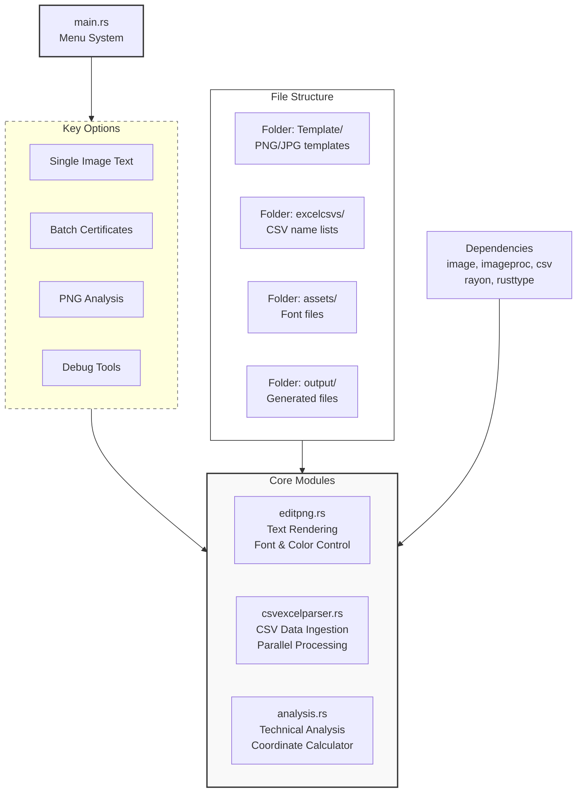

---

# Certificate Maker

A high-performance Rust-based utility for automated certificate generation. This tool enables the creation of personalized documents by overlaying data from CSV sources onto PNG/JPG templates with precise control over typography, color, and positioning.

## Features

* **PNG Metadata Analysis**: Inspect image dimensions, color profiles, and technical properties.
* **Dynamic Text Overlay**: Interactive placement of text with support for custom fonts and RGBA color selection.
* **High-Volume Batch Processing**: Generate hundreds of individual certificates from CSV datasets using parallel processing.
* **Automated Directory Management**: Built-in file system organization to manage templates, assets, and outputs efficiently.
* **Advanced Font Support**: Compatible with TTF, OTF, WOFF, and WOFF2 formats via the `assets` directory.
* **Integrated Debugging Suite**: Specialized tools for validating CSV formatting, template integrity, and font accessibility.

## System Architecture

The following diagram illustrates the relationship between the CLI menu system, the core processing modules, and the required file structure.



## System Requirements

* **Rust Toolchain**: Latest stable version of [Rust and Cargo](https://rustup.rs/).
* **Assets**: 
    * Image templates (PNG/JPG format).
    * Dataset (CSV files with a defined "Name" column).
    * Typography (TTF/OTF font files).

## Installation

1. **Clone the Repository**:
   ```bash
   git clone https://github.com/Not-Buddy/CertificateMakerRust.git
   cd CertificateMaker
   ```

2. **Initialize Directory Structure**:
   ```bash
   mkdir -p excelcsvs Template assets certificates output
   ```

3. **Populate Asset Directories**:
   * Place image templates in `/Template`
   * Place CSV data in `/excelcsvs`
   * Place font files in `/assets`

4. **Build and Execute**:
   ```bash
   cargo run
   ```

## Project Structure

```text
CertificateMaker/
├── src/
│   ├── main.rs            # Entry point and menu interface
│   ├── analysis.rs        # Image metadata and coordinate calculations
│   ├── editpng.rs         # Rendering engine and text overlay logic
│   └── csvexcelparser.rs  # Data ingestion and batch processing logic
├── excelcsvs/             # Source data (CSV)
├── Template/              # Design templates (PNG/JPG)
├── assets/                # Typography (TTF/OTF)
├── certificates/          # Batch generation output
└── output/                # Single-file test output
```

## Usage

### Menu Navigation
Upon execution, the application provides a numbered interface for the following operations:
1. **Single Image Overlay**: Add text to a single template for testing or one-off documents.
2. **Batch Generation**: Process a full CSV list to generate multiple certificates.
3. **Technical Analysis**: Retrieve resolution and suggested coordinate data for a template.
4. **Data Tools**: Create sample CSVs or debug existing file formatting issues.

### Dataset Configuration
The CSV parser expects a "Name" header (case-insensitive). Example `Names.csv`:
```csv
Name
Alice Johnson
Bob Smith
Charlie Brown
```

### Configuration Options
* **Positioning**: Supports manual X/Y coordinate input or automatic horizontal centering.
* **Color Syntax**: Accepts Hexadecimal codes (e.g., `#FF0000`) or standard color names (e.g., `white`, `blue`).
* **Rendering**: Leverages `imageproc` and `rusttype` for high-quality text rasterization.

## Dependencies

The project utilizes the following core crates:
* `image`: Image processing and encoding.
* `imageproc`: Text drawing and geometric transformations.
* `rusttype`: Font loading and glyph positioning.
* `csv` & `serde`: Data serialization and parsing.
* `rayon`: For parallelizing batch generation.

## Troubleshooting

| Issue | Resolution |
| :--- | :--- |
| **Directory Not Found** | Ensure the required folder structure exists in the project root. |
| **CSV Parsing Failure** | Verify the "Name" header exists and the file is comma-delimited. |
| **Font Errors** | Confirm the file extension is supported (TTF/OTF) and located in `/assets`. |
| **Coordinate Clipping** | Use the "Analyze PNG" tool to verify image dimensions relative to your X/Y inputs. |

## License

This project is licensed under the MIT License. See the `LICENSE` file for full details.
